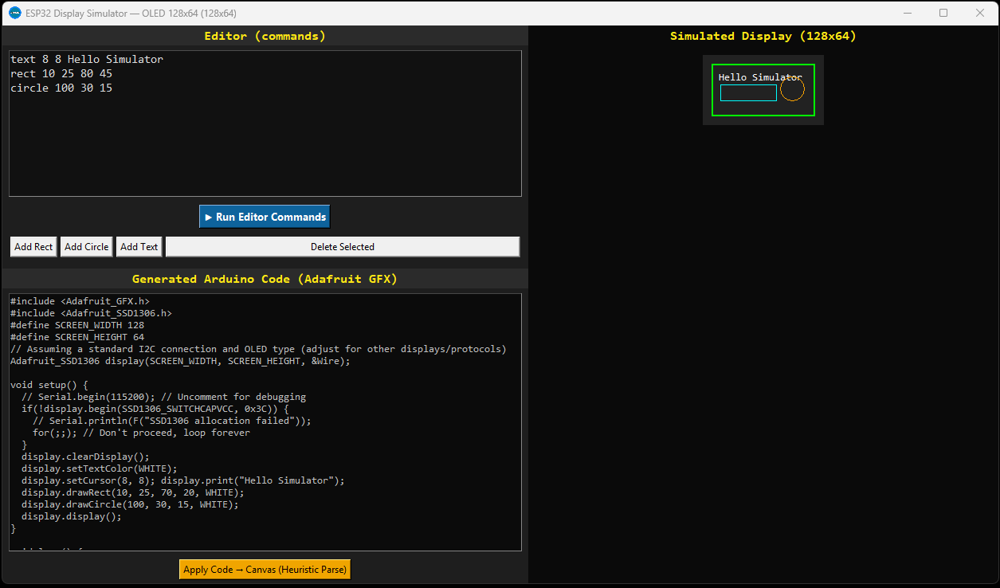

# ESP32 Display Simulator



A Python Tkinter-based desktop application to **visually design layouts** and **generate Arduino C++ code** for small graphic displays (like OLEDs and TFTs) commonly used with microcontrollers (e.g., ESP32, Arduino, STM32).

It allows you to place rectangles, circles, and text, move/resize them with a mouse, and instantly generates Adafruit GFX compatible C++ code.

---

## 📥 Download the App (Windows Executable)

The fastest way to use the simulator is to download the standalone executable (.exe). No Python installation required!

Click here to download the latest version: **[Download from Releases Page](https://github.com/Heavendart888/Esp32_display_simulator/releases)**

---

## 🚀 Getting Started (Source Code)

### Prerequisites

1.  **Python 3.x**
2.  **Tkinter**: This is usually included with standard Python installations. If you encounter issues (e.g., on Linux), you might need to install it separately (e.g., `sudo apt-get install python3-tk`).

### Installation and Run

1.  **Clone the Repository:**
    ```bash
    git clone [https://github.com/Heavendart888/Esp32_display_simulator.git](https://github.com/Heavendart888/Esp32_display_simulator.git)
    cd Esp32_display_simulator
    ```

2.  **Run the Application:**
    ```bash
    python designer.py
    ```

---

## 📝 Usage

1.  **Select Display:** Choose a preset (e.g., OLED 128x64) or enter custom `Width` and `Height`.
2.  **Design Layout:**
    * Use the **Add** buttons to place new Rectangles, Circles, or Text elements.
    * **Drag** elements on the canvas to move them.
    * The generated C++ code updates **live** as you move elements.
    * Select an element and press the **Delete** key to remove it.
    * Use the **left/right arrow keys** to visually indicate rotation (the rotation value is added as a comment in the generated code).
3.  **Generate Code:** Copy the Arduino C++ code from the **Generated Arduino Code** area and paste it into your microcontroller project's `setup()` function.

---

## 🤝 How to Contribute

This project is **open source**, and contributions are highly welcome! By contributing, you agree that your submissions will be licensed under the project's **MIT License**.

### Guidelines

1.  **Fork** the repository.
2.  Create your feature branch (`git checkout -b feature/AmazingFeature`).
3.  Commit your changes (`git commit -m 'Add some AmazingFeature'`).
4.  Push to the branch (`git push origin feature/AmazingFeature`).
5.  Open a **Pull Request**.

### Areas for Improvement

* Implementing **Resizing** functionality in `canvas_drag` mode.
* Adding support for **Filled** shapes (e.g., `fillRect`, `fillCircle`).
* Adding a UI for **Font/Text Size** selection.
* Expanding code generation to support other libraries (e.g., **TFT_eSPI**).

---

## 📜 License

This project is distributed under the **MIT License**. See the `LICENSE` file for more information.